<br>
<br>


 

<br>


 # SQL Eğitim Patika 

> #### Bu repo'da [Patika](https://academy.patika.dev/) SQL eğitiminde yapmış olduğunuz ödevler bulunmaktadır.

<br>

- **SQL Ödev 01 | WHERE ve Karşılaştırma & Mantıksal**
- **SQL Ödev 02 | BETWEEN ve IN**
- **SQL Ödev 03 | LIKE ve ILIKE**
- **SQL Ödev 04 | DISTINCT ve COUNT**
- **SQL Ödev 05 | ORDER BY | LIMIT ve OFFSET**
- **SQL Ödev 06 | Aggregate Fonksiyonlar**
- **SQL Ödev 07 | GROUP BY | HAVING**


<br>
<br>
<br>


## SQL Ödev 01 | WHERE ve Karşılaştırma & Mantıksal Operatörler 

<br>

1-) <strong>film </strong>tablosunda bulunan <strong>title</strong> ve <strong>description</strong> 
sütunlarındaki verileri sıralayınız.


```sql

SELECT title, description FROM film;

```
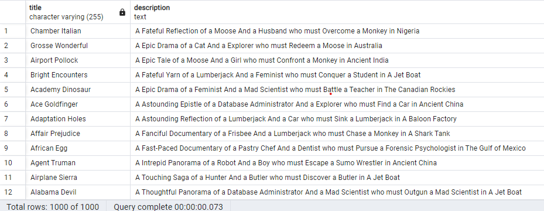

<br>
<br>
<br>

2-) <strong>film</strong>  tablosunda bulunan tüm sütunlardaki verileri film uzunluğu <strong>(length)</strong>  60 dan büyük <strong>VE</strong>  75 ten küçük olma koşullarıyla sıralayınız.


```sql

SELECT * FROM film
WHERE length > 60 AND length < 75;

```
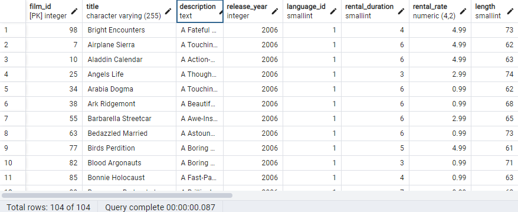


<br>
<br>
<br>

3-)  <strong>film</strong> tablosunda bulunan tüm sütunlardaki verileri  <strong>rental_rate</strong> 0.99  <strong>VE</strong>  <strong>replacement_cost</strong> 12.99  <strong>VEYA</strong> 28.99 olma koşullarıyla sıralayınız.


```sql

SELECT * FROM film
WHERE rental_rate = 0.99 AND replacement_cost = 12.99 
OR replacement_cost = 28.99;

```
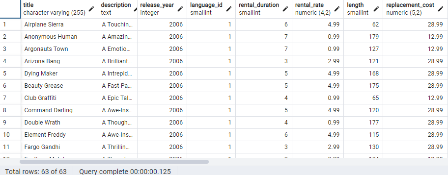


<br>
<br>
<br>

4-) <strong>customer</strong> tablosunda bulunan <strong>first_name</strong> sütunundaki değeri 'Mary' olan müşterinin <strong>last_name</strong> sütunundaki değeri nedir?


```sql

SELECT last_name FROM customer
WHERE first_name = 'Mary';

```
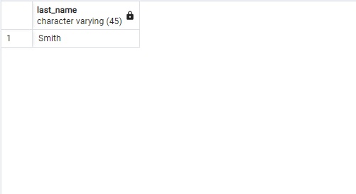


<br>
<br>
<br>

5-) <strong>film</strong>  tablosundaki <strong>uzunluğu(length)</strong>  50 ten büyük OLMAYIP aynı zamanda <strong>rental_rate</strong>  değeri 2.99 <strong>veya</strong>  4.99 OLMAYAN verileri sıralayınız.

```sql

SELECT * FROM film
WHERE length <= 50 
AND NOT (rental_rate = 2.99 OR rental_rate = 4.99);

```
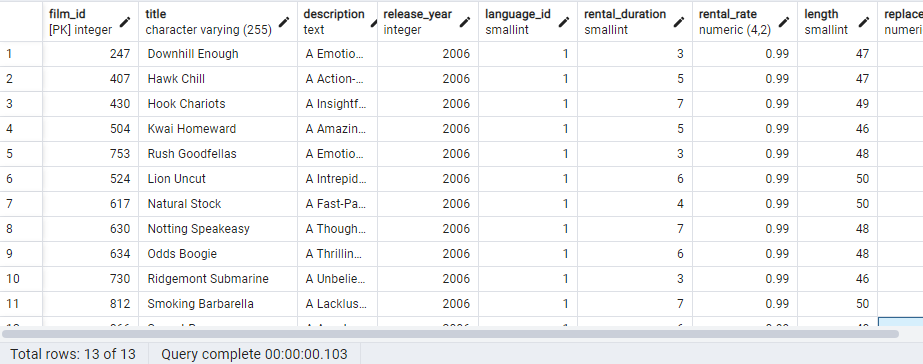

<br>
<br>
<br>


## SQL Ödev 02 | BETWEEN ve IN

<br>

1-) <strong>film</strong> tablosunda bulunan tüm sütunlardaki verileri <strong>replacement cost</strong> değeri 12.99 dan büyük eşit ve 16.99 küçük olma koşuluyla sıralayınız ( BETWEEN - AND yapısını kullanınız.)

```sql

SELECT * FROM film 
WHERE replacement_cost BETWEEN 12.99 AND 16.99;

```
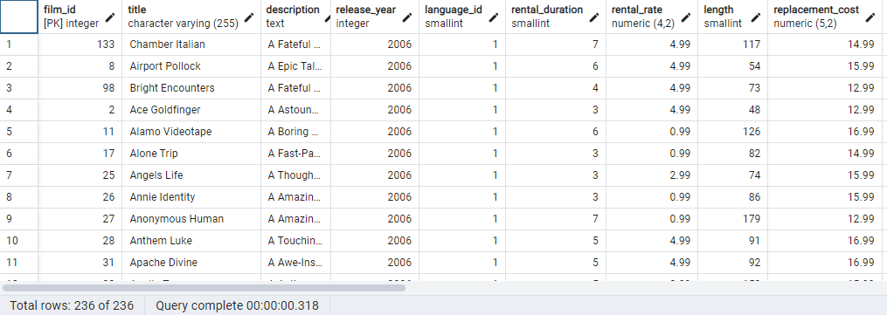

<br> 
<br>
<br>

2-) <strong>actor</strong> tablosunda bulunan <strong>first_name</strong> ve <strong>last_name</strong> sütunlardaki verileri <strong>first_name</strong> 'Penelope' veya 'Nick' veya 'Ed' değerleri olması koşuluyla sıralayınız. ( IN operatörünü kullanınız.)

```sql

SELECT first_name, last_name FROM actor 
WHERE first_name IN ('Penelope', 'Nick', 'Ed');

```
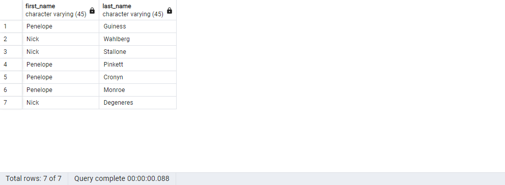

<br>
<br>
<br>

3-) <strong>film</strong> tablosunda bulunan tüm sütunlardaki verileri <strong>rental_rate</strong> 0.99, 2.99, 4.99 VE <strong>replacement_cost</strong> 12.99, 15.99, 28.99 olma koşullarıyla sıralayınız. ( IN operatörünü kullanınız.)

```sql

SELECT * FROM film
WHERE rental_rate IN (0.99, 2.99, 4,99) AND replacement_cost IN (12.99, 15.99, 29.99);
```
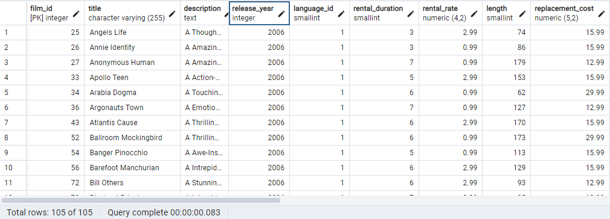

<br>
<br>
<br>

## SQL Ödev 03 | LIKE ve ILIKE

<br>

1-)  <strong>country</strong> tablosunda bulunan  <strong>country</strong> sütunundaki ülke isimlerinden 'A' karakteri ile başlayıp 'a' karakteri ile sonlananları sıralayınız.

```sql

SELECT country FROM country
WHERE country LIKE 'A%a' 

```
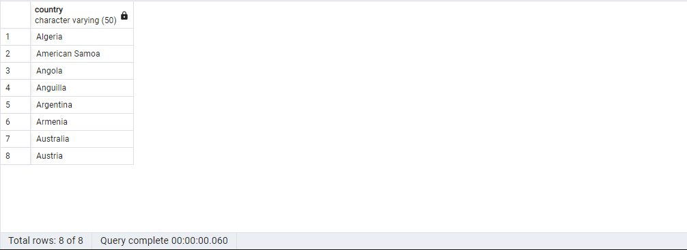


<br>
<br>
<br>

2-) <strong>country</strong> tablosunda bulunan <strong>country</strong> sütunundaki ülke isimlerinden en az 6 karakterden oluşan ve sonu 'n' karakteri ile sonlananları sıralayınız.

```sql
SELECT country FROM country 
WHERE country LIKE '_____%n' 
```
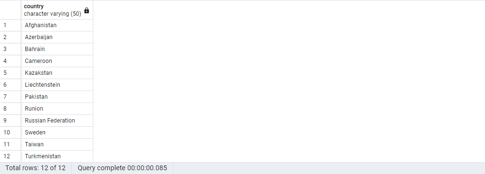

<br>
<br>
<br>

3-) <strong>film</strong> tablosunda bulunan <strong>title</strong> sütunundaki film isimlerinden en az 4 adet büyük ya da küçük harf farketmesizin <strong>'T'</strong> karakteri içeren film isimlerini sıralayınız.

```sql
SELECT title FROM film 
WHERE title ~~* '%T%T%T%T%' 
```
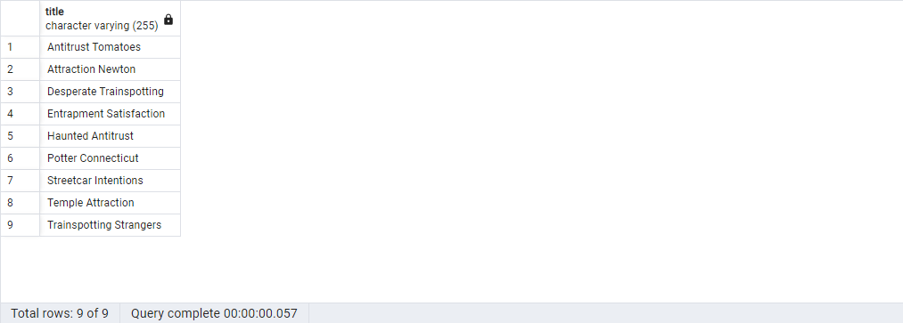

<br>
<br>
<br>

4-) <strong>film</strong> tablosunda bulunan tüm sütunlardaki verilerden <strong>title</strong> 'C' karakteri ile başlayan ve uzunluğu (length) 90 dan büyük olan ve <strong>rental_rate</strong> 2.99 olan verileri sıralayınız.

```sql
SELECT * FROM film 
WHERE title LIKE 'C%' AND length > 90 AND rental_rate = 2.99; 
```
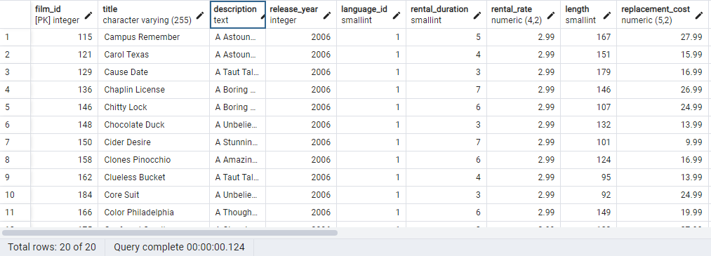

<br>
<br>
<br>

## SQL Ödev 04 | DISTINCT ve COUNT

<br>

1-)  <strong>film</strong> tablosunda bulunan  <strong>replacement_cost</strong> sütununda bulunan birbirinden farklı değerleri sıralayınız.

```sql

SELECT DISTINCT replacement_cost FROM film

```
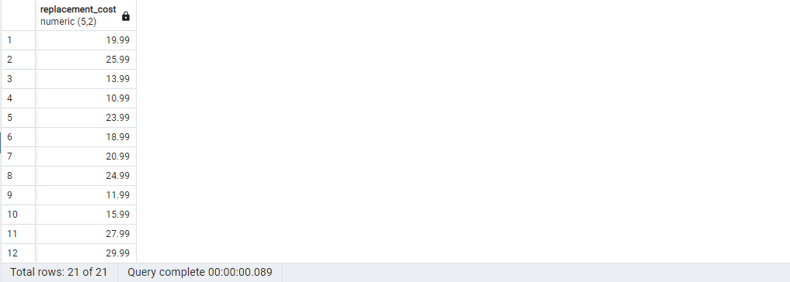

<br>
<br>
<br>

2-) <strong>film</strong> tablosunda bulunan <Strong>replacement_cost</strong> sütununda birbirinden farklı kaç tane veri vardır?

```sql

SELECT COUNT (DISTINCT replacement_cost) FROM film

```
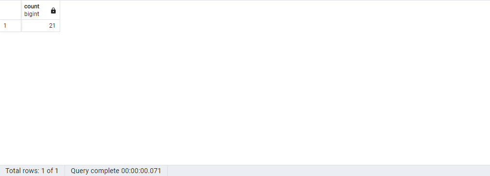

<br>
<br>
<br>

3-) <strong>film</strong> tablosunda bulunan film isimlerinde  <strong>(title)</strong> kaç tanesini T karakteri ile başlar ve aynı zamanda  <strong>rating</strong> 'G' ye eşittir?

```sql

SELECT COUNT(*) FROM film 
WHERE title LIKE 'T%' AND rating = 'G';

```

<br>
<br>
<br>


4-) <strong>country</strong> tablosunda bulunan ülke isimlerinden (country) kaç tanesi <strong>5</strong> karakterden oluşmaktadır?


```sql

SELECT COUNT(DISTINCT country) FROM country
WHERE country LIKE '_____';

```
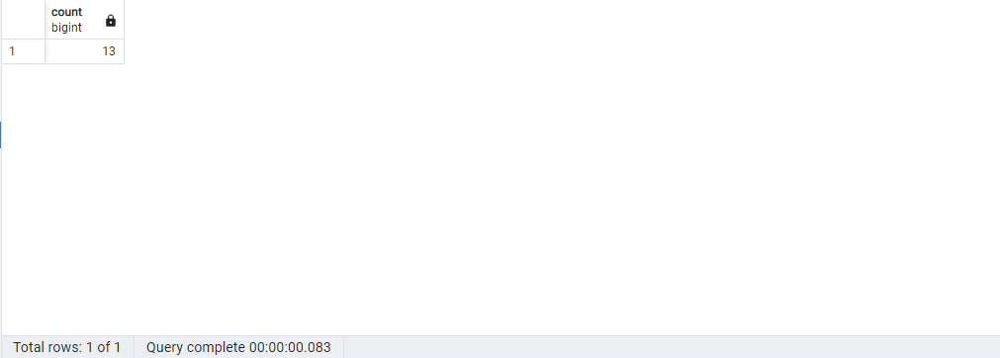

<br>
<br>
<br>

5-) city tablosundaki şehir isimlerinin kaç tanesi 'R' veya r karakteri ile biter?

```sql

SELECT COUNT(DISTINCT city) FROM city
WHERE city ILIKE '%r';

```

<br>
<br>
<br>

## SQL Ödev 05 | ORDER BY | LIMIT ve OFFSET

<br>

1-) film tablosunda bulunan ve film ismi (title) 'n' karakteri ile biten en uzun (length) 5 filmi sıralayınız.

```sql
SELECT title, length FROM film
WHERE title LIKE '%n'
ORDER BY length DESC
LIMIT 5;
```
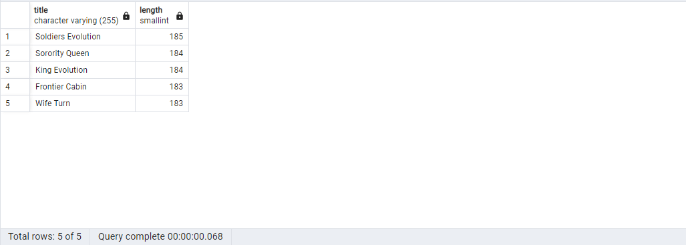
<br>
<br>
<br>

2-) film tablosunda bulunan ve film ismi (title) 'n' karakteri ile biten en kısa (length) ikinci(6,7,8,9,10) 5 filmi(6,7,8,9,10) sıralayınız.


```sql
SELECT title, length FROM film
WHERE title LIKE '%n'
ORDER BY length ASC
OFFSET 5
LIMIT 5;
```
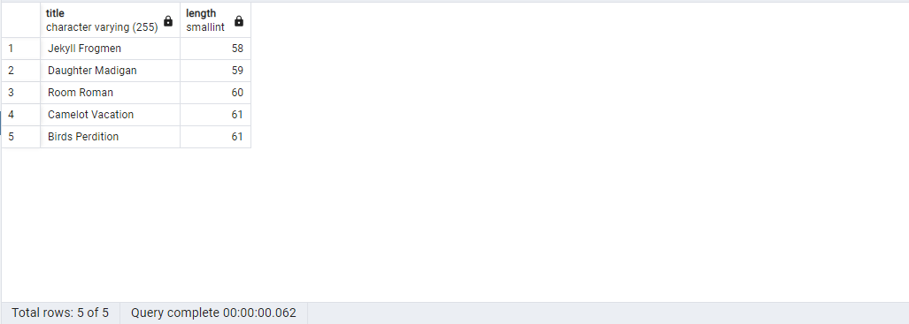
<br>
<br>
<br>

3-) customer tablosunda bulunan last_name sütununa göre azalan yapılan sıralamada store_id 1 olmak koşuluyla ilk 4 veriyi sıralayınız.


```sql
SELECT *
FROM customer
WHERE store_id = 1
ORDER BY last_name DESC
LIMIT 4;
```
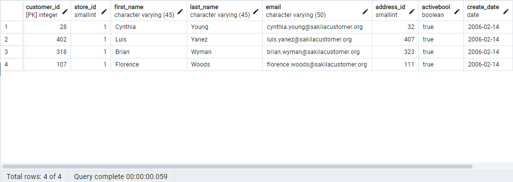
<br>
<br>
<br>

## SQL Ödev 06 | Aggregate Fonksiyonlar

<br>

1-) film tablosunda bulunan rental_rate sütunundaki değerlerin ortalaması nedir?


```sql
SELECT ROUND(AVG(rental_rate),3) 
FROM film ;
```


<br>
<br>
<br>

2-) film tablosunda bulunan filmlerden kaç tanesi 'C' karakteri ile başlar?

```sql
SELECT COUNT(*)
FROM film
WHERE title LIKE 'C%';
```

<br>
<br>
<br>

3-) film tablosunda bulunan filmlerden rental_rate değeri 0.99 a eşit olan en uzun (length) film kaç dakikadır?

```sql
SELECT MAX(length) 
FROM film 
WHERE rental_rate = 0.99;
```
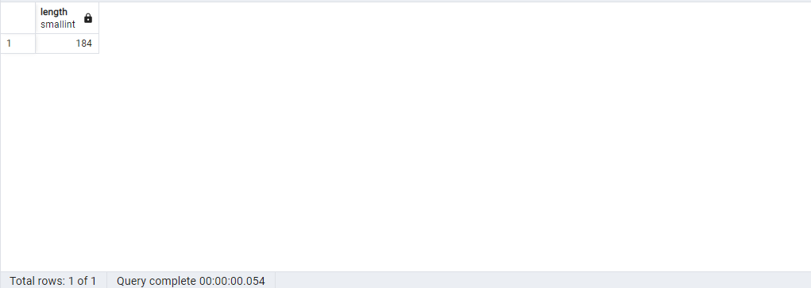
<br>
<br>
<br>

4-) film tablosunda bulunan filmlerin uzunluğu 150 dakikadan büyük olanlarına ait kaç farklı replacement_cost değeri vardır?


```sql
SELECT COUNT(DISTINCT replacement_cost) 
FROM film 
WHERE length > 150;
```
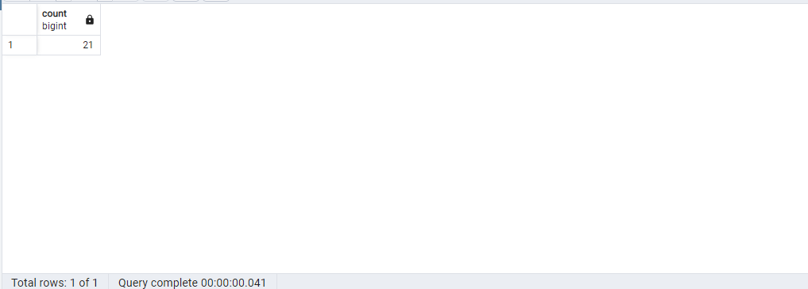
<br>
<br>
<br>

## SQL Ödev 07 | GROUP BY | HAVING

<br>

1-) film tablosunda bulunan filmleri rating değerlerine göre gruplayınız.


```sql
SELECT rating, COUNT(*) FROM film
GROUP BY rating;
```
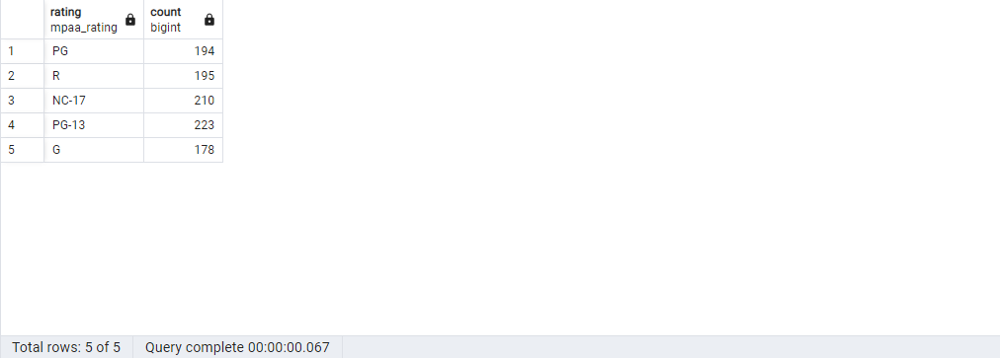

<br>
<br>
<br>

2-) film tablosunda bulunan filmleri replacement_cost sütununa göre grupladığımızda film sayısı 50 den fazla olan replacement_cost değerini ve karşılık gelen film sayısını sıralayınız.

```sql
SELECT replacement_cost, COUNT(*)
FROM film
GROUP BY replacement_cost
HAVING COUNT(*) > 50
```
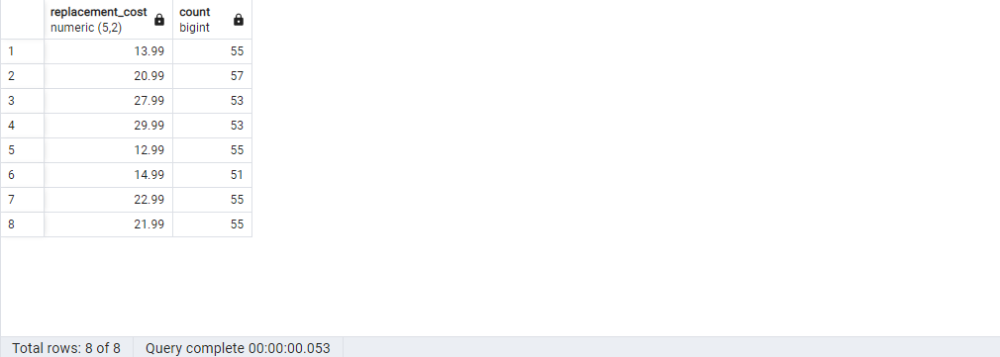
<br>
<br>
<br>

3-) customer tablosunda bulunan store_id değerlerine karşılık gelen müşteri sayılarını nelerdir?

```sql
SELECT store_id, COUNT(*) 
FROM customer
GROUP BY store_id;
```
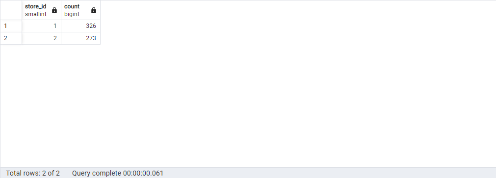
<br>
<br>
<br>

 4-) city tablosunda bulunan şehir verilerini country_id sütununa göre gruplandırdıktan sonra en fazla şehir sayısı barındıran country_id bilgisini ve şehir sayısını paylaşınız.

 ```sql
SELECT country_id, COUNT(*) 
FROM city
GROUP BY country_id
ORDER BY COUNT(*) DESC
LIMIT 1;
```
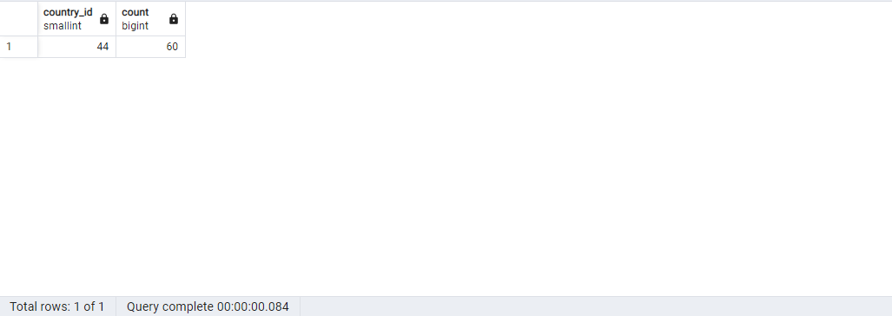


<br>
<br>
<br>
<hr>
<br>

Bu repo'da [Patika](https://academy.patika.dev/) SQL eğitimindeki ödevler vardır. İçerisinde bir adet README dosyası barındırıyor.


## Installation

Öncelikle projeyi clonelayın.

```
https://github.com/ibrahimkahramann/sql.git
```

## Usage

Projeyi cloneladıktan sonra Visual Studio Code programında açınız.

Linux için:

```
cd sql
code .
```

## Contributing
Pull requestler kabul edilir. Büyük değişiklikler için, lütfen önce neyi değiştirmek istediğinizi tartışmak için bir konu açınız.

## License
[MIT](https://choosealicense.com/licenses/mit/)

<br>

<hr>
